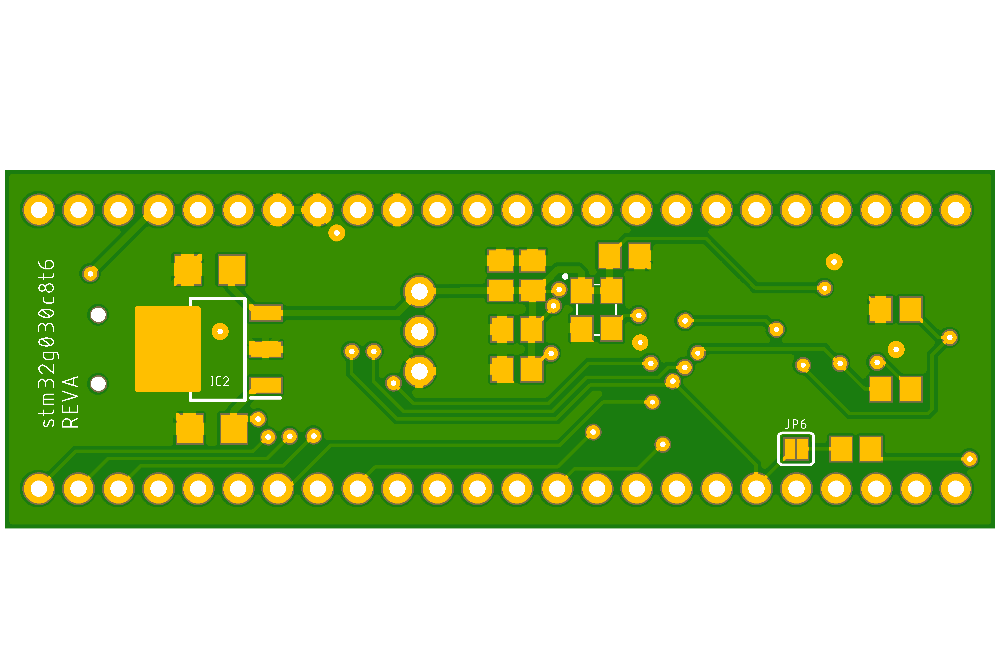

# stm32g030c8t6
Simple breakout board for stm32g030c8t6

3.3v LDO powered from 5V USB.
UART connectivity to USB via ch340 optionally connected to pins PA9/PA10 using jumpers.
ARM SWD programming interface header.
All other pins are broken out to headers.
1 LEDS optionally connected to pin PB0 using jumper.
1 Button with pulldown optionally connected to pin PB1 using jumper.
1 Button connected to RESET pin, pulled high.

![Board Top][(Hardware/stm32g030c8t6/images/stm32g030c8t6-Top.png)

